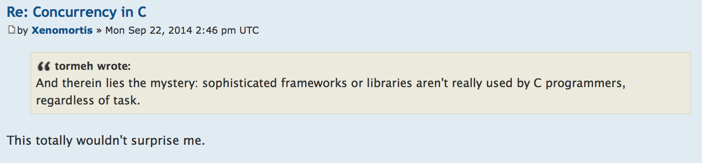

- title : Concurrency in F#
- description : A presentation that describes the ins and outs of concurrency in F#
- author : Henrik Feldt
- theme : sky
- transition : default

***

## Concurrency in F#

***

### Agenda

 - Concurrency Use-Cases
 - Solution Mapping – A Broad Outline
 - F# Async<>
 - Hopac

**Ask questions anytime!**

***

### Me, me, me

The Philosofer of Software.  CEO for [qvitoo](https://qvitoo.com) - a startup, all F#, all unix.

In the Empowerment, Dev, Ops roles.

[@henrikfeldt](https://twitter.com/henrikfeldt) – [henrik@haf.se](mailto:henrik@haf.se)

' Passion for simple distributed systems and excellent user experiences
' Been programming since 14, invoicing since 16.
' Trying to understand and put words on the world.
' Empowerment: making people grow. Lean.
' Dev: making software.
' Ops: operating software.

---

### OSS

Authored:

 - [Logary][logary] – actor based log, metrics, trace framework
 - [albacore](https://github.com/Albacore/albacore/) - cross platform build framework

---

Contributed/co-authored:

 - [Suave](http://suave.io/) - Suave is a lightweight, non-blocking web server. Applicative Functors for control flow.
 - [Http.fs](https://github.com/relentless/Http.fs) - Functional HTTP client

---

### At Work

 - Previously Software Architect at large HR-software firm
 - Set up Hybrid cloud/dc environment in AWS from scratch
 - Set up continuous integration, continuous deployment, micro-services infrastructure
 - Set up logging and metrics
 - Set up hybrid win/unix CM environment
 - Taught Distributed Systems

***

### Concurrency Use-Cases

Concurrency is generally needed for two cases;

 - Interleaving IO with computation
 - Making things happen wall-clock faster

---

### This brings with it...

 - Who/What?; Synchronisation / Coordination
 - When?; Scheduling
 - Relativity; Concurrent truths
 - Peopleware; The need for an API design
 - Properties; liveness, safety
 - Values/Data; in rest, in transit & consistency

---

### Four Use-Cases:

 1. The web server (RPC servers)
 2. The web client (RPC clients)
 3. The distributed system (Messages, Consistency)
 4. The FRP app

1, 2 are temporally coupled.

3 is not so much.

---

### 1) The Web Server – Why

Multiple clients connect to a server which serves **files**, **streams**, **dynamically
generated content** or act as **coordinators** to tertiary systems.

---

### The Web Server – Constraints

When implementing a web server;

 - should be **stateless** (from a scale-out perspective)
 - should **efficiently** and
 - **concurrently** serve multiple clients
 - should have a **low overhead** on top of application code

' SL: the web server should not keep local per-request state
' Eff: a slow reader should not starv other readers
' Eff: execution at max load should be CPU bound for normal apps
' Con: one execution context should not block others
' OH: read lazily, 100 cont, low lvl internal coord

---

### The Web Server – How

**chunk righteously**

Stateless - no sessions

Efficiency - precompute with partial application

Efficiency - solve trade-off overhead+lazyness versus blocking+eagerness

Concurrency - spawn green threads

' chunk up, chunk down

---

### Use-Case 2 – The Web Client – Why

OSI Layers, App Layers:  (IP -> TCP){1, n} -> Raw HTTP -> App HTTP -> App

' mk conn, timeouts.
' mk n conn, alts. commit.
' mk n conn, retry. commit.
' parse http
' interpret app sem. http
' act in app
' choice: 'Alt', Async=Job

---

### Use-Case 2 – The Web Client – Constraints

IP/TCP: Don't hang. Abstract socket, except timeouts and failure.

Raw HTTP: Transparent redirects, retries, MD5 checksums, Not Modified, etc

App HTTP: Hypermedia Navigation, conneg, langneg, value modulation/serialisation, etc

App: opt-in deal with all semantics above

' ---
' ### Use-Case 2 – The Web Client – How

---

### Use-Case 3 – The Distributed System – Why

---

### Use-Case 3 – The Distributed System – Constraints

---

### Use-Case 3 – The Distributed System – How

***

### Solution Mapping

 * Multiprogramming (aka threads)
 * Cooperative Multithreading

***

### Multiprogramming

Standard on macrokernel level.i  Yields efficiency for fairness.

Slice time into quantas:

    [lang=c]
    #define RR_TIMESLICE            (100 * HZ / 1000)

On interrupt, save a *process control block*.

---

E.g. Apache when nginx came out.

Hard to do coordination & synchronisation right.

' Source: http://forums.xkcd.com/viewtopic.php?f=11&t=109964

---

### Sources of errors

 - Heisenbugs
 - Race Conditions
 - Process states:
   - Responsive
   - Unresponsive, up
   - Responsive, corrupt
   - Crashed
   - 'Clean shut down'
 - Trade-offs:
   - Availability → Non-safety
   - Safety → Non-Availability

***

### Cooperative Multithreading

Standard inside apps, on microkernel level. Fairness up to programmer.

Two flavours;

 1. interrupt driven/push
 2. pull/select

***

### F# Async<>

    [lang=fsharp]
    let sendMessage (stream : Stream) (msg : Msg) = async {
      use ms = new MemoryStream() // TODO: re-use MS?
      Serializer.Serialize(ms, msg)
      let len = int (ms.Position)
      ms.Seek(0L, SeekOrigin.Begin) |> ignore
      do! writeLen len stream
      do! transfer len ms stream
      }

' Source: https://github.com/logary/logary/blob/master/src/targets/Logary.Targets.Riemann/Client.fs

### Hopac

### References

 [logary]: https://github.com/logary/logary
 [vrr]: http://pmg.csail.mit.edu/papers/vr-revisited.pdf
 [hopac-p]: https://github.com/Hopac/Hopac/blob/master/Docs/Programming.md
 [hopac-ies]: https://docs.google.com/presentation/d/1Yowsc3MV9xWqHJ3u11B0xYqqqeK368BW_dfZ9_H0WJI/edit?pli=1#slide=id.g9142b12c1_1_45
 [towards-verifiable-es]: http://rd.host.cs.st-andrews.ac.uk/publications/itces06.pdf

